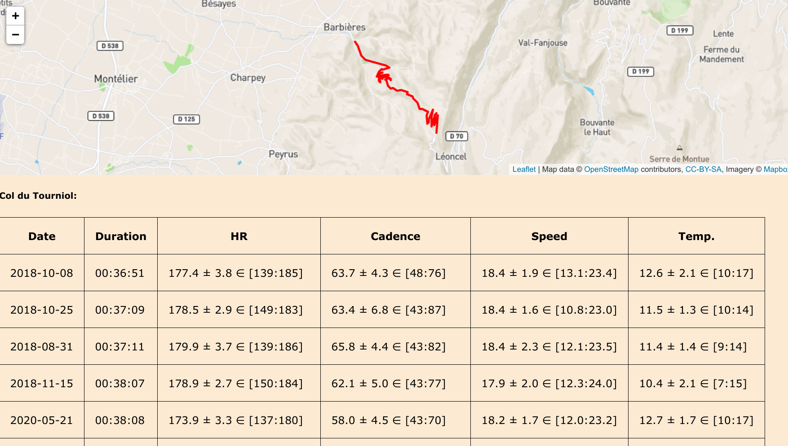

# Goal

Detect segments in FIT files, measure distances, duration and several metrics
(heart rate, speed, cadence, temperature). For each metric, the average,
standard deviation and interval are computed.

# Installation

`pip install -r requirements.txt`

# Usage

## Prepare a segment definition file

First, you need to define the segments you are interested in. These segment
definitions have to be stored in `segment_definitions.json`. You can either:

- Create this file manually using `segment_definitions.json.example` as a
  template. Coordinates can be easily retrieved (e.g. with
  [GPXSee](https://www.gpxsee.org/)).

- Create this file automatically from Strava segments. To do this, you need to
  create a file `strava_segments.json` (see `strava_segments.json.example`)
  listing your segments of interest, and convert them into
  `segment_definitions.json` with `import_strava_segments.py`.

## Import your FIT files

Once you have the `segment_definitions.json` file and the FIT files exported
from your Garmin device, you can search for segments with: `fit2segments.py`.

```
usage: fit2segments.py [-h] [--verbose] fitfiles [fitfiles ...]

Parse a list of FIT files and generate the following output files:

- `segments.json`: JSON file containing all segments and timings
- `activities.json`: JSON file containing all activities
- `ui/userdata/data.js`: JS file containing all activities
- `ui/userdata/*.json`: JSON file containing the trace of each activity
- `segmentname_timings.csv`: CSV files containing date, kms, and duration (minutes)
- `segmentname_debug.csv`: CSV file containing detected virtual start and stop points
  (labeled by date), as well as segment reference (labeled w/segment name)

positional arguments:
  fitfiles       FIT files

optional arguments:
  -h, --help     show this help message and exit
  --verbose, -v  Verbose mode
```

## Text UI

- You can view a specific activity with `activity.py`, e.g.

```
********************************************************************************
Date: 2020-05-21 06:11:47
Duration: 1:55:03
********************************************************************************

Segment    : Col du Tourniol

  Duration : 0:38:08
  HR       : 173.9 bpm  ± 3.3 ∈ [137:180]
  Cadence  :  58.0 Hz   ± 4.5 ∈ [43:70]
  Speed    :  18.2 km/h ± 1.7 ∈ [12:23]
  Temp.    :  12.7 °C   ± 1.7 ∈ [10:17]

  All-time :   5/214    𝚫 PR : 0:01:17 (0:36:51, 2018-10-08)
  This year:   1/  2    𝚫 PR : 0:00:00 (0:38:08, 2020-05-21)

Segment    : col des Limouches from the D70/D68

  Duration : 0:07:16
  HR       : 164.8 bpm  ± 5.8 ∈ [149:172]
  Cadence  :  57.5 Hz   ± 4.3 ∈ [46:68]
  Speed    :  18.3 km/h ± 2.6 ∈ [15:26]
  Temp.    :  16.7 °C   ± 0.5 ∈ [16:17]

  All-time :   4/191    𝚫 PR : 0:00:34 (0:06:42, 2018-08-03)
  This year:   3/  3    𝚫 PR : 0:00:06 (0:07:10, 2020-05-27)

```

## Web UI

A simple VueJS-based viewer is provided in the `./ui` subdirectory:

- get a free mapbox token, and put it in `./ui/userdata/accessToken.js` (see
  `./ui/userdata/accessToken.js.example`)
- start the web server with `./start_server.sh`
- open your browser `http://localhost:8000/index.html`

Enjoy.

.

# Note

- Reading FIT files is slow. Once read, they are bz2's pickle'd in
  `~/.cache/fit2segments` directory.
